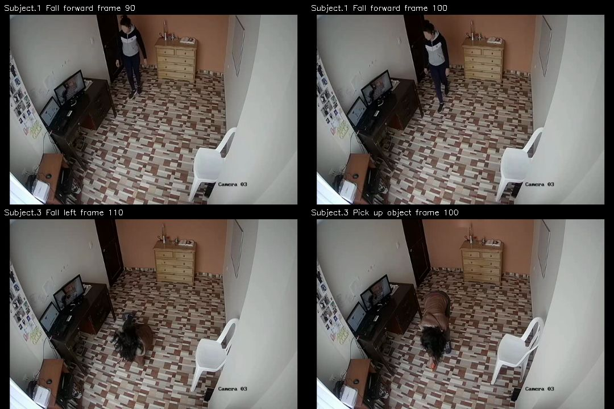

# Stage 1.3 — CAUCAFall V5 pose compatibility

**Decision: PASS WITH WARNINGS for AVI → MediaPipe Tasks → 33-landmark compatibility.**

All 100 AVIs decoded sequentially: 19,877 frames, zero metadata-count mismatches, zero early termination flags. Every video ended at its expected count. OpenCV read failure cannot directly distinguish EOF from corruption; this establishes full sequential readability and count agreement, not visual integrity of every decoded frame.

The fixed subset covers all ten activities across five subjects. All 1,724 subset frames were submitted to real MediaPipe; 1,504 returned valid poses (87.23898%), 220 had no pose. All detected poses contained exactly 33 finite landmarks; zero malformed results or inference errors occurred. No skeleton arrays were saved.

## Per-video measurements

Visibility statistics aggregate all returned landmarks, including low-visibility joints. Coverage is pose availability, not pose accuracy or fall-classifier performance.

| Subject | Activity | Label | Valid / decoded | Missing | Coverage | Visibility min / mean / max | Longest missing run |
| --- | --- | --- | --- | --- | --- | --- | --- |
| Subject.1 | Fall forward | fall | 94 / 190 | 96 | 49.47% | 0.0893 / 0.8190 / 1.0000 | 92 frames (4.60 s) |
| Subject.2 | Fall backwards | fall | 119 / 119 | 0 | 100.00% | 0.0257 / 0.7969 / 1.0000 | 0 frames (0.00 s) |
| Subject.3 | Fall left | fall | 147 / 171 | 24 | 85.96% | 0.0263 / 0.7827 / 1.0000 | 12 frames (0.60 s) |
| Subject.4 | Fall right | fall | 150 / 150 | 0 | 100.00% | 0.0514 / 0.7588 / 0.9999 | 0 frames (0.00 s) |
| Subject.5 | Fall sitting | fall | 224 / 229 | 5 | 97.82% | 0.0707 / 0.8854 / 1.0000 | 5 frames (0.25 s) |
| Subject.1 | Sit down | non_fall | 187 / 187 | 0 | 100.00% | 0.0354 / 0.7555 / 1.0000 | 0 frames (0.00 s) |
| Subject.2 | Kneel | non_fall | 130 / 130 | 0 | 100.00% | 0.0499 / 0.7244 / 1.0000 | 0 frames (0.00 s) |
| Subject.3 | Pick up object | non_fall | 132 / 186 | 54 | 70.97% | 0.0939 / 0.8410 / 1.0000 | 18 frames (0.90 s) |
| Subject.4 | Walk | non_fall | 222 / 240 | 18 | 92.50% | 0.0963 / 0.8666 / 1.0000 | 18 frames (0.90 s) |
| Subject.5 | Hop | non_fall | 99 / 122 | 23 | 81.15% | 0.1324 / 0.8675 / 1.0000 | 23 frames (1.15 s) |

Exact relative AVI paths and missing intervals are in [pose_summary.json](pose_summary.json); the same per-video measurements are in [pose_inventory.csv](pose_inventory.csv).

## Environment and reproducibility

Actual successful runtime: Python 3.13.15, MediaPipe 0.10.35, OpenCV 4.12.0 on macOS-26.5.1-arm64-arm-64bit-Mach-O.

The current 1.0.1 package installed but aborted during CPU graph initialization. The tested workaround pins 0.10.35, retaining Python 3.13, the official Tasks API, and the same Full model. Its crash signature is consistent with upstream issue #6356, whose Python 3.14.5 differs from our 3.13.15; identical root cause is not established. See [environment notes](environment_notes.md) for details. CPU inference uses XNNPACK; the macOS package also initialized a Metal/OpenGL context, so this run does not prove headless macOS portability. No architecture change or cloud GPU requirement is introduced.

Full float16 v1 model SHA-256: `5134a3aad27a58b93da0088d431f366da362b44e3ccfbe3462b3827a839011b1`.

VIDEO mode; CPU delegate; one pose; detection/presence/tracking thresholds all 0.5; segmentation off. Original 20 FPS and 720×480 frames; BGR→RGB; timestamps increase 50 ms from clip-local zero. Tracker resets between videos. No thresholds were tuned after observing results.

## Visual review and failure interpretation

All 12 automatically selected JPEG diagnostics plus the four-frame context sheet were inspected. Together the 13 small JPEG files are diagnostic excerpts, not a processed dataset. Green connections/red landmarks are displayed only when visibility is at least 0.5; absence of a drawn joint does not mean fewer than 33 were returned.

- Forward fall: frames 0–91 lacked pose (4.6 seconds). Reviewed frames 0, 47 and 90 show an upright person near the doorway; frame 100 is also upright and lies after tracking acquisition. This long gap is therefore not wholly attributable to floor-level posture. Distance, contrast and view angle are hypotheses, not isolated causes. Additional gaps at 133 and 136–138 are recorded without assigning an unobserved cause.
- Forward-fall frame 142 has a detected floor-level pose with the torso and visible limbs broadly aligned. A distal arm reaches the bottom image boundary, so this is not evidence of precise localization for every joint.
- Left-fall frame 110 is within missing interval 105–116 (0.6 seconds) and shows a floor-level, folded posture with overlapping body parts. Floor-level orientation/self-occlusion is a plausible association; no causal ablation was done.
- Pick-up frame 100 is inside missing interval 95–112 (0.9 seconds). The person is bent deeply toward the camera; hair/head/body overlap obscures part of the upper body. This supports an association with unusual orientation and self-occlusion. Its initial missing frame also shows the person near the doorway.
- Sitting-fall frames 54–58 are missing (0.25 seconds). Reviewed frame 54 shows a bent, transitioning body near the chair, with visible blur around moving limbs. Motion blur and self-occlusion are possible contributors.
- Kneel frames 32 and 97 and Walk frames 60 and 180 have broadly aligned torso/limb overlays. Kneel and Sit down each have 100% returned-pose coverage, but kneeling distal joints can have low visibility.
- Walk frames 0–17 and Hop frames 0–22 lack pose. Their first frames show an upright person; the hop image has some visible blur. These are startup gaps, with the actual cause unresolved.
- Partial out-of-frame position is not established as the cause of any missing pose. No claim is made that lighting, blur, occlusion or orientation alone caused the observed failures.



## Decision and Stage 2 implications

The predeclared mechanical criterion fails on decode/inference errors, malformed landmark output, or zero valid poses in any clip; otherwise missing poses trigger warnings. No arbitrary percentage threshold was used. Visual review found usable aligned detections in fall and ADL examples, and no sample activity was wholly unusable. This supports PASS WITH WARNINGS for this narrow compatibility check, not a claim of robust fall detection.

No dataset-format blocker prevents designing Stage 2. Stage 1.4 must define the dataset protocol, including missing-pose/low-visibility policy. Stage 1.3 neither interpolates nor fabricates missing poses, nor silently excludes their frames from the coverage denominator. Before a full preprocessing run, specify and test that handling, preserve original timestamps and explicit missingness, and retain a reproducible working runtime. Do not interpolate across the 92-frame startup gap as if it were a brief dropout; do not silently discard low-coverage clips. Revalidate CPU compatibility on the eventual edge platform. The left-fall and pick-up gaps deserve review when defining that protocol.

Stage 1 remains current. This task does not settle subject-independent splitting, feature definitions, or the complete reproducible preprocessing protocol. Stage 2 was not started.

## Commands and validation

Executed main commands (repository root):

```sh
UV_CACHE_DIR=/private/tmp/caucafall-uv-cache uv run ml/datasets/inspect_caucafall.py
curl -L --fail --output ml/checkpoints/pose_landmarker_full.task https://storage.googleapis.com/mediapipe-models/pose_landmarker/pose_landmarker_full/float16/1/pose_landmarker_full.task
UV_CACHE_DIR=/private/tmp/caucafall-uv-cache UV_HTTP_TIMEOUT=120 MPLCONFIGDIR=/private/tmp/caucafall-matplotlib uv run ml/datasets/validate_pose_compatibility.py
UV_CACHE_DIR=/private/tmp/caucafall-uv-cache uv run --python 3.13 --no-project python -m unittest discover -s tests -v
git diff --check
```

The pose command was first attempted with 1.0.1 and aborted; after the documented dependency pin, it completed with 0.10.35. Separate uv Python probes tested 1.0.1 import/GPU initialization; they produced no pose measurements. A read-only OpenCV snippet sequentially read four selected context frames (S1 forward 90/100, S3 left 110, S3 pick-up 100), resized them only for the context sheet, and saved no other frames.

All 11 unittest tests passed. Synthetic fixtures test decoding accounting, missing intervals and decision gates only; reported compatibility statistics come from the actual sample videos. Full-media and pose report consistency checks also passed.
